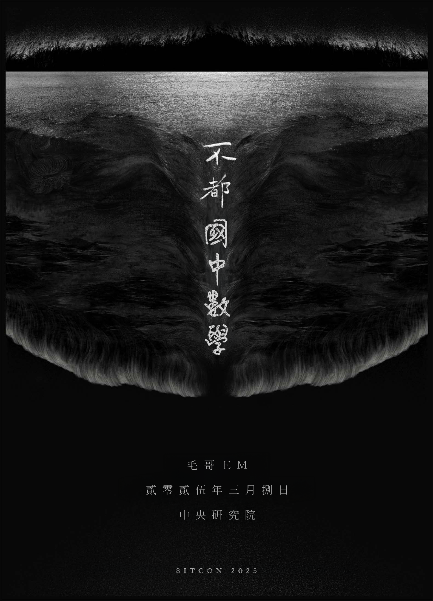

# SITCON 2025 - 前端特效：不都國中數學

> [!TIP]
> **議程的 QA 回答整理在 [毛哥EM資訊密技](https://emtech.cc/p/SITCON-2025)**

> 🕓 16:05 - 16:45 📍 R0  
> [SITCON 官網介紹](https://sitcon.org/2025/agenda/aa71e5/)

> *這個議程的主題也參考自草東沒有派對的演唱會：不都媽生的。*

## 資源

* 今天講到的開關和相融效果範例原始碼在 `example/` 資料夾中。
* 更多關於網頁的小技巧可以參考我的部落格 - [毛哥EM資訊密技](https://emtech.cc/category/%E7%B6%B2%E9%A0%81%E9%96%8B%E7%99%BC)。
* 初版的簡報使用 Marp 製作，你可以在 `slides.md` 中找到原始碼，`slides.html` 查看渲染的結果，Release 頁面查看最終的簡報 PDF。

## Credit

> 感謝大助借我在 SITCON 2025 的簡報中使用他的貼圖，如果你喜歡的話可以到 [Line](https://store.line.me/stickershop/product/29397820/zh-Hant) 或 [Telegram](https://t.me/addstickers/daisuketw) 下載。

* 圖片
  * [旋轉魚](https://geometry-dash.fandom.com/f/p/4400000000000116879)
  * [游標圖示](https://www.flaticon.com/free-icon/cursor_204506) 
  * [Principles of Motion](https://www.pinterest.com/pin/906349493739599702/) 
  * [Foxmosa](https://moztw.org/foxmosa/)
  * [長角的 Chrome](https://x.com/UQurage/status/1798548156726292854/photo/1)
* 字體
  * [源石黑體丹](https://github.com/ButTaiwan/genseki-font)
  * [饅頭黑體](https://github.com/mant0u0/MantouSans)
  * [源雲明體](https://github.com/ButTaiwan/genwan-font)
* 網站範例
  * [Only CSS: Water Surface](https://codepen.io/YusukeNakaya/pen/vvEqVx)
  * [Procreate Pocket](https://procreate.com/pocket)
  * [ChainGPT Labs](https://labs.chaingpt.org/)
> 你是網頁開發者嗎？也許你會對中文 Webfont 服務 [emfont](https://font.emtech.cc/) 感興趣？近期會進行大更新喔！
