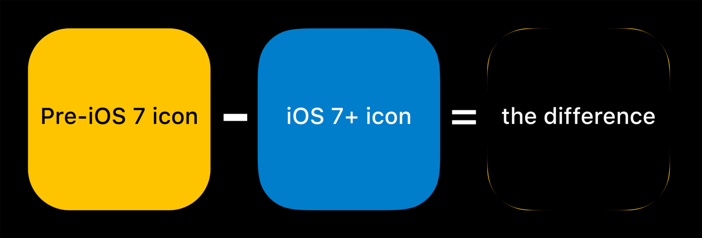

<!-- @format -->

<style>
section.center {
  text-align: center;
}

section.gray {
    color: #ffff!important;
}
:root{
      --color-background-code: #222222;
      --color-foreground: #FFF;
    }

    pre code{
        border-radius: .5em;
        background-color: #2C3142;
        border: 2px solid #858487;
    padding: 1.2em;
    } 
  
  code{
    border-radius: 7px;
  }

  h1,h2,h3,h4,h5,h6{
    color: #DDD8CB;
  }
  .lr{display:flex;justify-content: center;align-items: center;gap:6rem;}
</style>

# 前端特效：不都國中數學

毛哥 EM @SITCON 2025

---


---


---

<!-- _class: left -->

<div class=lr>

<div>

## 毛哥 EM

數位創作者 | 全端工程師

<div style="font-size: 0.8em;margin-top:3rem;">

-   西苑高中高三 ⇀ 交大資工
-   九年網頁開發經驗
-   Awwwards 評審

</div>

</div>


</div>

---

## 目錄

-   網頁基礎原理
-   CSS 特效
-   JavaScript 特效
-   案例原理拆解
-   問答與互動

---

## 網頁基礎

HTML & CSS 是什麼

---

## HTML + CSS


---

## HTML


---

## HTML

```html
<div>
    <h1>我是標題</h1>
    <p>我是段落</p>
</div>
```

---

## <span style="color: yellow">CSS</span>

```css
div {
    color: yellow;
}
```

---


---


---


---

<div class="lr">

<div>

<div style="position:relative;width: 400px;height: 400px;background: linear-gradient(#FFF 50% ,#8b9bcc 50%,#8b9bcc 51%, #FFF 51%);">

</div>

</div>

```html
<div>::after</div>
```

</div>

---

<div class="lr">

<div>

<div style="width: 400px;height: 400px;background-color: #FFF;"></div>

</div>

```css
div {
}
```

</div>

---

<style>
.box{
  position:relative;
}

.box::before{
  content: "";
  position: absolute;
  top: 0%;
  left: 0%;
  background: #ddd8cb;
  width: 400px;
  height: 400px;
  border-bottom-left-radius: 400px;
}
</style>

<div class="lr">

<div>

<div class="box" style="width: 400px;height: 400px;background-color: #FFF;"></div>

</div>

```css
.box::before {
    content: "";
    position: absolute;
    top: 0%;
    left: 0%;
    background: #ddd8cb;
    width: 400px;
    height: 400px;
    border-bottom-left-radius: 400px;
}
```

</div>

---


---

有 CSS 你可以排出任何版面

---

太難的話...

---


---

## 動畫 / 特效

一個屬性隨著另外一個屬性改變


---

## 範例

-   逐格動畫: 時間 = 第幾張圖片
-   滑鼠追蹤: 元素位置 = 滑鼠位置
-   滾動視差: 元素偏移 - 滑鼠滾動量 \* 速度
-   3D 旋轉: 元素位置與角度 = 時間 \* 速度

---

## CSS 特效基礎概念與案例剖析

---


---


-   CSS 排版: 外框/內圓
-   記錄狀態: 勾選/未勾選
-   CSS 動畫: 移動/變色...

---

## 動畫條件

| 屬性     | 關閉時 | 開啟時 |
| -------- | ------ | ------ |
| 位置     | 0%     | 100%   |
| 背景顏色 | 灰色   | 藍色   |

---

## CSS 動畫

-   transition - 自動動畫
-   keyframes - 自訂動畫

---

## transition

```css
div {
    transition: color 300ms;
    transition: all 0.3s ease-in-out;
}
```

---


<!-- 可以提到 Apple -->

---

Cubic Bézier 二次貝茲曲線


額這不是國中數學

---

> Apple:
> ❌ ease
> ✅ gravity

---

> Apple:
> ❌ border-radius
> ✅ 曲率連續

---


---



將工業設計中的曲線連續概念應用到了視覺設計之上，更圓滑，無明顯切角。


---


---

## keyframes

旋轉範例

```css
@keyframes spin {
    0% {
        transform: rotate(0deg);
    }
    100% {
        transform: rotate(360deg);
    }
}
```

---

無限重複

```css
animation: spin 2s linear infinite;
```

停在最後狀態

```css
animation: spin 2s linear forwards;
```

---

## keyframes

```css
@keyframes switch {
    0% {
        left: 0;
        background-color: gray;
    }
    100% {
        left: 100%;
        background-color: blue;
    }
}
```

---

## 範例


---

```css
@keyframes horizontal {
    from {
        transform: translateX(0);
    }
    to {
        transform: translateX(calc(100vw - 100%));
    }
}
```

...

---

#### 疊起來

```css

div {
    animation:
        horizontal 2.6s infinite linear alternate,
        vertical 2s infinite linear alternate,
        colorX 26s infinite steps(10),
        colorY 14s infinite steps(7);

    animation-composition: accumulate;
}
```

---

## 漸層動畫


---

```css
body {
    margin: 0;
    overflow: hidden;
}
div {
    background: linear-gradient(45deg, red, yellow, blue);
    animation: gradientChange 4s infinite linear;
    height: 200vh;
    width: 200vw;
}
```

---

```css
@keyframes gradientChange {
    0% {
        transform: translate(0, 0);
    }
    25% {
        transform: translate(-50%, 0);
    }
    50% {
        transform: translate(-50%, -50%);
    }
    75% {
        transform: translate(0, -50%);
    }
    100% {
        transform: translate(0, 0);
    }
}
```

---


## 相融黏滯效果

---


```css
.circle-big,
.circle-small {
    filter: blur(10px);
}

.box {
    filter: contrast(20);
}
```

---

## 範例 - 相融黏滯效果


---

## Lightbox


---

-   動畫一開始就播了
-   複雜計算困難
-   量大起來很難做
-   有些屬性 CSS 拿不到

---

## JavaScript

這才是程式語言

---

## JavaScript 簡介

-   Brendan Eich 花十天搞出來的東西
-   現在被大家亂搞，什麼都能做
-   因為當時 Java 很紅，所以叫 JavaScript

---

## JavaScript 在動畫中扮演的角色

-   事件監聽
    -   計算
    -   溝通
-   操作 DOM (改動 HTML, CSS)
-   渲染 Canvas

---

## 今天我們要拿 JavaScript 追蹤

-   頁面滾動
-   滑鼠位置
-   裝置傾斜

---


---

## 動畫原理

先來點數學

---


---


---

在指定範圍內?：

# f(鼠標數值) = y

---

直線方程

# y=ax+b

a (m): 斜率 (速度)

---

| 滾動量 | 位置 |
| ------ | ---- |
| 0      | 0%   |
| 200    | 100% |

m = y 變化量 / x 變化量  
= (100% - 0%) / (200 - 0) = 0.5%
y = 0.5% \* x

---


---

## 滾動視差

```javascript
window.addEventListener("scroll", function () {
    let scroll = window.scrollY;
    let rate = 0.5;
    let position = scroll * rate;
    document.querySelector(".box").style.top = position + "px";
});
```

---


---

```js
const element = document.getElementById("element");
window.addEventListener("scroll", function () {
    const scrollY = window.scrollY;
    if (scrollY < 100)
        element.style.transform = `translateY(${scrollY * 1.4 + 10}px)`;
});
```


---


---

## [bamboofox.org](https://bamboofox.org/)

-   滑鼠位置 / 裝置傾斜
-   滾動視差


---

## 把滾動量抓去 CSS

```css
:root {
    --scroll: 0;
}
```

```css
.box {
    top: var(--scroll);
}
```

---

## 把滾動量抓去 CSS

```js
window.addEventListener("scroll", function () {
    let scroll = window.scrollY;
    document.documentElement.style.setProperty("--scroll", scroll);
});
```

---

## Js 叫你去動

添加 class

```js
document.querySelector(".box").classList.add("active");
```

```css
.box.active {
    animation: switch 1s linear forwards;
}
```

---

## Js 叫你去動

添加 class

```js
window.addEventListener("scroll", function () {
    let scroll = window.scrollY;
    if (scroll > 100) {
        document.querySelector(".box").classList.add("active");
    } else {
        document.querySelector(".box").classList.remove("active");
    }
});
```

---

## Js 叫你去動

添加 class

```js
window.addEventListener('scroll', function() {
    let scroll = window.scrollY;
   document.querySelector('.box').classList.toggle('active', scroll > 100);
    }
});
```

---

## 不要躲在下面動

```css
div{
    opacity: 0;
    transition: opacity 0.5s;
}

div.active{
    opacity: 1;
}
```

---

```js
function isElementInViewport(el) { //在嗎？
    const rect = el.getBoundingClientRect();
    return rect.bottom < 0 || rect.top > window.innerHeight;
}

function addClassToVisibleElements() { //加 class
    var aosElements = document.querySelectorAll(".aos");
    aosElements.forEach(function (aosElement) {
        if (!isElementInViewport(aosElement)) aosElement.classList.add("ed");
        else aosElement.classList.remove("ed");
    });
}

document.addEventListener("scroll", addClassToVisibleElements); //滾動時檢查
addClassToVisibleElements(); //一開始檢查
```


---


幾行程式一次取代 Animate.css、WOW.js、AOS、ScrollReveal 這些函式庫，而且還有更簡單更高的自訂性。

---

emtech.cc 動畫計算


---

## 一定得 JavaScript？

日本 CodePen 作者 Yusuke Nakaya 的作品


---

```css
div:hover{

}
```

---

```html
div*100
```

---

```html
div*100000000
```

---

```css
@for $i from 0 through 100{
     
    $x: $i % 10;
    $y: ($i - $x) / 10;
     
    .position:nth-child(#{$i + 1}):hover ~ .ball {
        top: #{$y * 10}vh;
        left: #{$x * 10}vw;
    }
}
```

---

我們使用100個元素，將整個頁面鋪滿，懸停的時間，顯示顏色。


---

> *瀏覽器：我也真是謝謝你*


---

## 案例分析

-   [ChainGPT Labs](https://labs.chaingpt.org/)
-   [Dropbox](https://brand.dropbox.com/)

---

> 你覺得程式跟解題用到的數學差在哪？
> -交大特選面試題

---

> 咱們之後專門做一個演講來講解。

---


> 多點想法、多點思考、多點發散的空間總是好的。

---

## QA

<div style=text-align:left;>

今日簡報及範例程式碼：[github.com/Edit-Mr/SITCON2025](https://github.com/Edit-Mr/SITCON2025)
關於我：[elvismao.com](https://elvismao.com)
毛哥 EM 資訊密技：[emtech.cc](https://emtech.cc)

</div>
